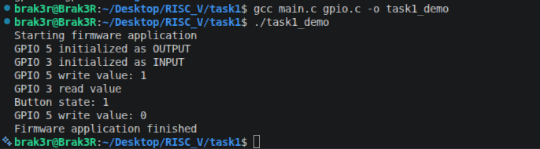
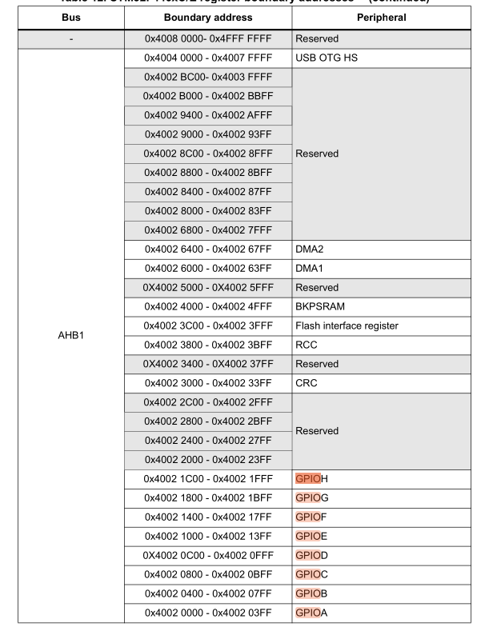

# Task 1: Firmware Library Fundamentals

## Task did:

- how firmware libraries are structured  
- how application code uses APIs  
- Setting up a basic development environment  
- Building and study a simple firmware-style library  


---

### Step 1: Files Observation:

Observed the files `gpio.h` , `gpio.c` , `main.c` 

here in above files :
`gpio.h`  -> header file for gpio.c. 
`gpio.c`  -> main gpio driver file.
`main.c`  -> where all the drivers and header files have been called.
also, have explained it in details in understanding of the task.  


---

### Step 2: Build the Code

- building the code by running the following commands:

```bash
gcc main.c gpio.c -o task1_demo
````
---

### Step 3: Run the Program

```bash
./task1_demo
```

---

## Expected Output

As expected its generated the proper simulating behaviour of the GPIO.
using the `printf()` library functions.

---

## Explanation 

   ### What is a firmware library?

   * Firmware library is the library where register level programming has been done, for example, each gpio port has dedicated registered address which we can get it from the microcontroller datasheet.
   

  ### Why are APIs important?

   * API's are important because , each new microcontroller has different different addresses for their peripherals, also its more time consuming then doing the actual real world project on it. API's for GPIO which we have used here in the above example are in `GPIO.c` file. So rather than going deep into the register level we simply call API which is more convinient and more benefitial to complete the project which needs more attention to.
   
   ### Understanding form the above task:

   * from the above task I have understood that to run the program you need proper header file which are at the system default location with the syntax : `#include <stdio.h>` or at our local directory :`#include "gpio.h"`.

   * which we can include in our program so that it can call the API's which we have implemented on the header files.

   * here are the API for the GPIO functions which are there in gpio.h file:
   `void gpio_init(int pin, int direction);`
   `void gpio_write(int pin, int value);`
   `int  gpio_read(int pin);`

   * which can be act as input as well as output with 0 and 1 ,and it has been implemented as macros.

   * we used macros because it easy to change the gpio pin which we needed for preferred task.

   * In above example we have use PIN: 5 and PIN: 3 ,respectively as OUTPUT and as INPUT.

   * Also this does not apply to the microcontroller board yet , the structure which we are going through will remain same , where gpio.c acts as a driver for the GPIO peripheral as it has function definition. and GPIO.h has the function declaration.

   * And we have linked the main.c and gpio.c files together to make executable file because we have linked the gpio.c file statically linkning. and gpio.h and stdio.h file will gets linked automatically as dynamically linked.

---


