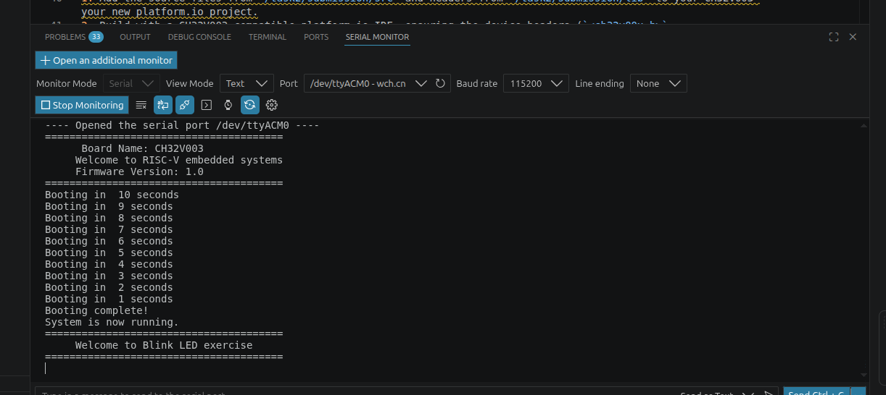
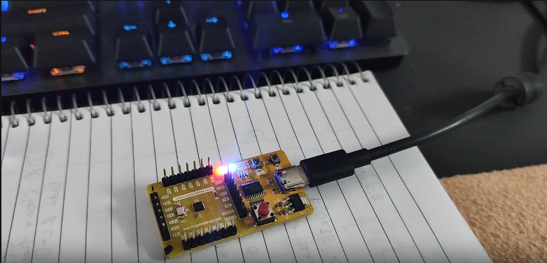

## Task 2 Evidance : 

### UART Evidence
Screenshot and video showing 10+ lines of UART output

### GPIO Evidence
Photo and a short video clearly showing:
The physical board
The pin being toggled (LED / probe / visible signal)
## click on the thumbnail below: 

## ------------------------------------------------------
Physical pin label : `GPIO pin PD6` , in-built LED
Firmware GPIO number : `Port D pin 6`

### Short explanation  : 
Implemented GPIO + UART basic firmware on the board ch32v003 VSD squadron mini, by calling the macros for the GPIO and UART pins ,
Steps to implementation:
1. connected USB to WCH-Link and got the device name in the system as : `/dev/ttyACM0`.
2. created main function which calls the header files where UART and GPIO has respected PINs configured and initialized.
3. during the execution the main function will call initialization of all the neccessary peripherals first to enable the peripheral for the application/firmware.
4. implemented UART message which can display on serial monitor , after controller getting RESET , hence it will show the booting process with the name of the board and firmware version with the booting sequence. 
5. then implemented logic in the while loop where LED blink at rate of every 2 second first it will turn ON and stays on for 1 second then it will turn OFF and stays OFF for 1 second and this will be in a while(1) loop which can run infinitely, until we power down of the board.
 

### verified correct behavior : 
- Hence from the video and from the dry running the code we can check the correct behaviour of the GPIO + UART peripherals in the system. 
