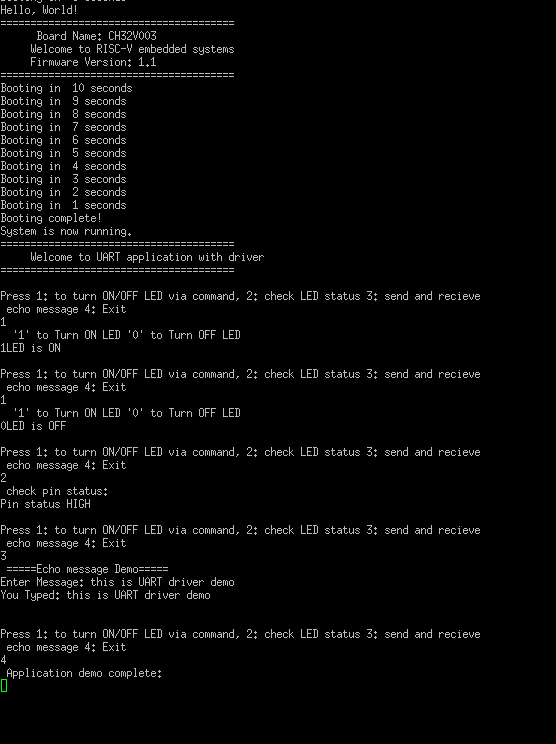
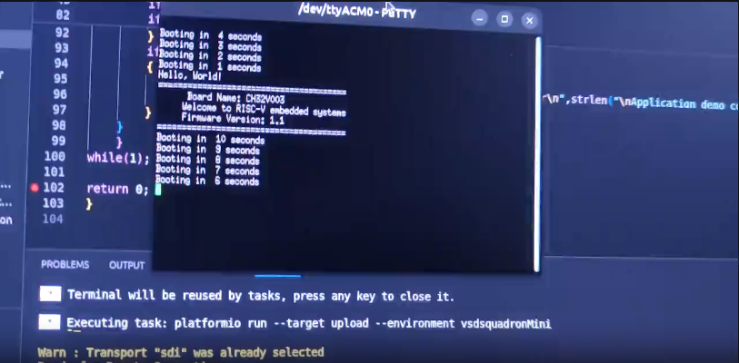

### TASK3 : Evidance of completing the Task3 making UART driver and implemting Demo on functions.

### Screenshot Evidance for the UART demo : 

[]

* Here I am using Putty as viewing the Output of UART API, and using (9600) baud rate.
* By using the UART API and after getting proper output from the application , can confirm that we have successfully implemented the UART Application with its driver API's, which we can use it in other application whenever needed.
* Here have used  polling and blocking method, and not used Interrupt, non-blocking method.
* Future application might be needed Interrupt method , hence there is room for improvement in the code.

### kindly press the Thumbnail for the proof of application running...

## Conclusion: Implemented UART driver + application successfully.