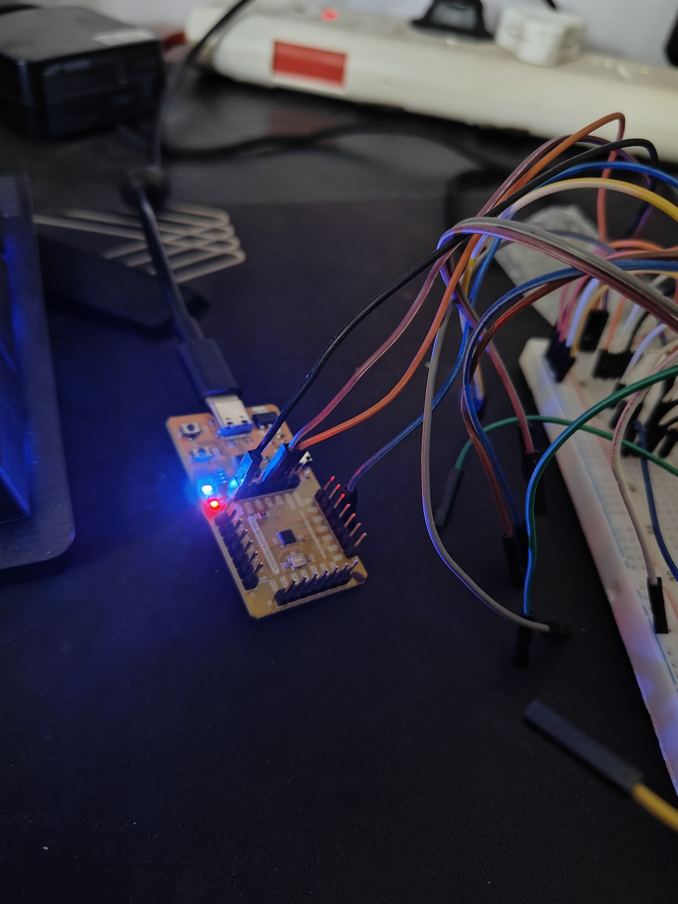
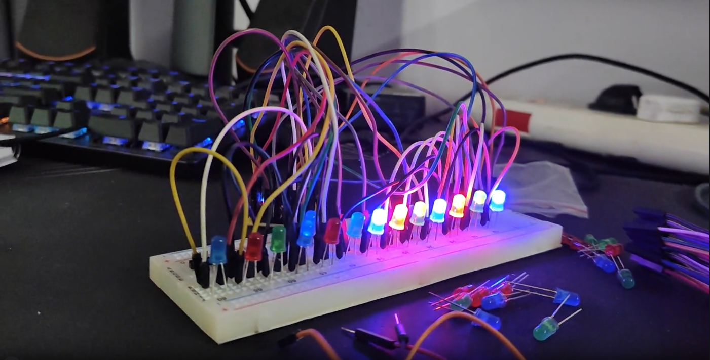
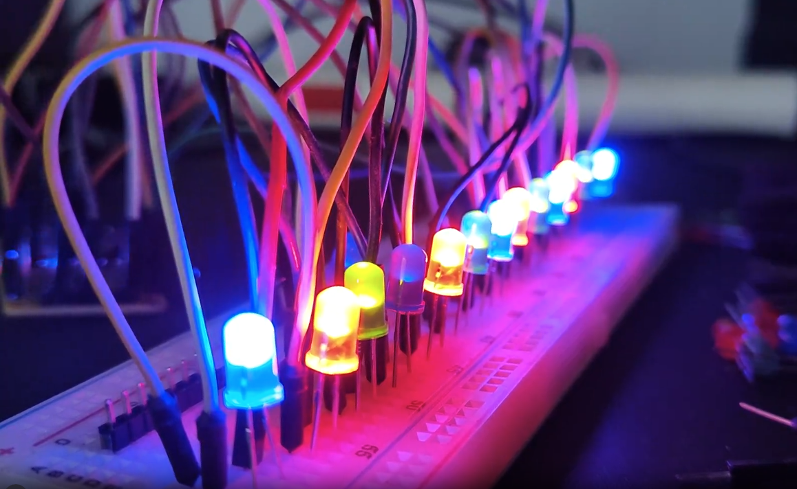
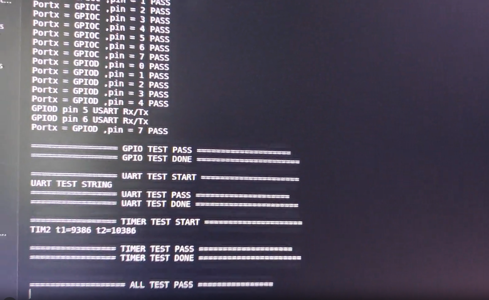
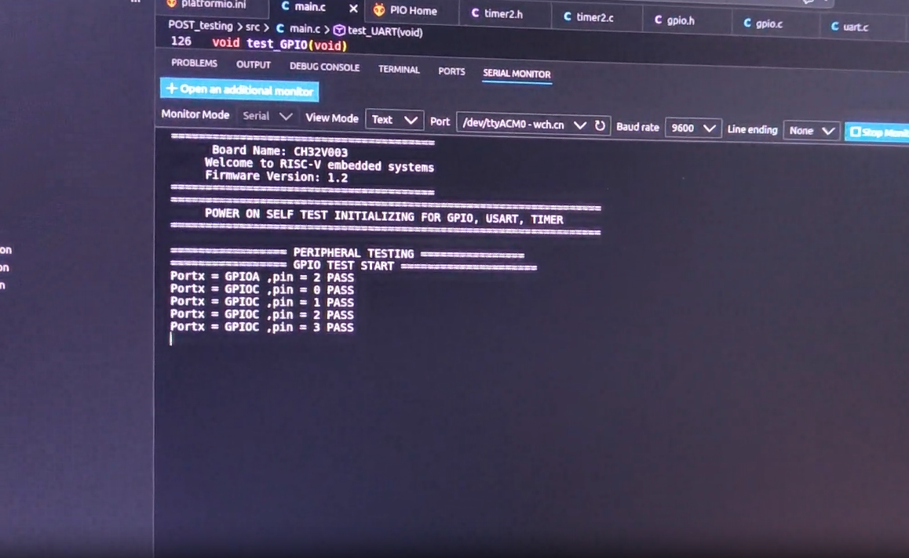

## TASK 4 : Implemented POWER ON SELF TEST on CH32V003 controller from scratch.

---
### Driver used: 
1. `GPIO`
2. `UART`
3. `TIMER`   //here we have used TIM2 (general purpose timer.)

---

OUTPUT on serial monitor: 
[]

---

Evidance of POST test:
Output of POST test : 
[]

---

TEST Video 1: GPIO
click on thumbnail.
[](images/output_1.mp4)

---

TEST video 2: GPIO HARDWARE Visualization 
click on thumbnail.
[](images/output_2.mp4)

---

TEST video 3: OUTPUT on Serial monitor `UART` and `TIMER`
click on thumbnail.
[](images/output_3.mp4)

---

TEST video 4 : FINAL OUTPUT as per the process.
click on thumbnail.
[](images/output_Final.mp4)

---
 
## what you tested : 
1. Tested the `GPIO workflow`, and turned ON all Possible LED's in this controller, there are only 15 GPIO, we can only use 12 GPIO as INPUT/OUTPUT.
Others they are dedicated to UART , as RX and TX , and others connected to SWDIO.
2. Tested `UART loopback` test using Rx and Tx pin by shorting them and sending and receiving data simultaneously within 10 ms timeout scaling using timer.
3. Tested `Timer counting` using this timer have tested the delay in 1 second, and using timer i am getting the same time delay of 1 second without any tolerance of (+-50) hence getting accurate reading.
 
## What worked: 
1. when earlier when i used the uart with the user input, it went well but to testing the UART functionality in Power On Self Test, No user input would be involved, hence I have used `Timer` with the `UART` so that i can get proper data without any timeout, also there is new API for only for testing which is `uart_SendReceive()` function.
2. Also implemented all the API's from the scratch without any 3rd party libraries/ pre-build libraries.Only used Registers from the datasheet as per the guidance on it verified the flow of the initialization of each and every driver.

## Limitations remains: 

1. Flash memory of the controller is lower than expected

```
RAM:   [==        ]  18.9% (used 388 bytes from 2048 bytes)
Flash: [=====     ]  52.8% (used 8644 bytes from 16384 bytes)
```

Used almost 50% of the Flash memory by using only 3 driver.

Next focus would be to reduce the memory utilization on the flash for this program, because in future if we want to use RTOS on it, as well as more than 5 drivers onto the same memory then it would be needed external flash memory, and we can attach to this controller via `SPI` protocol. 
Otherwise this controller is great for the smallscale projects, which can have fewer drivers applications.

---

## Future scope: (small projects)
1. Adding PWM peripheral, and changing the brightness of the LED's.
2. Adding timer and use it as Alarm with blink LED. 
3. Adding Buzzer so that this Controller can act as Alarm clock. 
4. using UART user Input can add the ALARM time.

---

# Conclusion : completed the POST verification and validation using the GPIO,TIMER,UART peripherals.