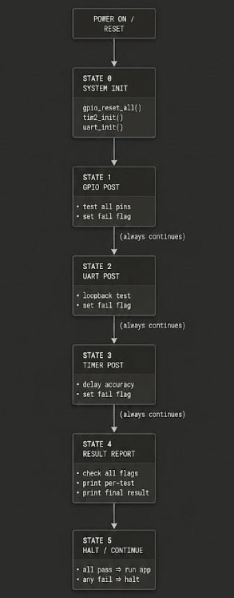

# Application Demo — CH32V003 POST Framework

This document explains the application logic in `main.c` — how the POST sequence
is orchestrated, what states it moves through, how timing is managed, and how
edge cases are handled. For driver internals, see `ARCHITECTURE.md`.

---

## Application States

The POST application moves through a strict linear sequence of states. There is
no return to a previous state and no branching between tests — every state runs
to completion before the next begins.

[]

> **Key design decision:** the application never early-exits on a single failure.
> All three tests always run so every fault is visible in one POST report.
> This is critical during board bring-up where multiple peripherals may fail
> simultaneously.

---

## Task Flow

### State 0 — System Initialisation

```
gpio_reset_all()
    │
    ├── resets GPIOA, GPIOC, GPIOD via RCC_APB2PRSTR
    └── must be first — clears any stale pin config from bootloader

tim2_init()
    │
    ├── enables TIM2 clock on APB1
    ├── sets PSC = 23999 → 1ms tick at 24MHz
    ├── writes UG bit → loads shadow registers immediately
    └── starts free-running counter — must be before uart_init()
        because uart receive timeout depends on tim2_get_ms()

uart_init(gpio_portD, GPIO_PIN_5, GPIO_PIN_6)
    │
    ├── enables USART1 + AFIO + GPIOD clocks
    ├── configures PD5 as AF push-pull output (CFGLR nibble 0xB)
    ├── configures PD6 as floating input      (CFGLR nibble 0x4)
    └── sets BRR = 2500 for 9600 baud at 24MHz
        enables UE, TE, RE in CTLR1
```

**Timing:** completes in < 1ms. TIM2 counter is already running by the time
`uart_init()` returns.

---

### State 1 — GPIO POST

```
for each port in [GPIOA, GPIOC, GPIOD]:
    for each pin in valid range:
        │
        ├── skip reserved pins (PD0, PD1, PD5, PD6)
        │       → print "SKIP" + reason
        │       → continue to next pin
        │
        ├── gpio_init(port, pin, OUTPUT)
        │       → enable clock
        │       → read-modify-write CFGLR (4 bits only, others untouched)
        │
        ├── gpio_set_pin(port, pin)
        │       → write BSHR bit to drive HIGH
        │
        ├── gpio_read_pin(port, pin)
        │       → read INDR bit
        │       │
        │       ├── 1 → print "PASS"
        │       └── 0 → print "FAIL"
        │               result_gpio_fail_flg = 1
        │
        ├── gpio_reset_pin(port, pin)
        │       → write BCR to drive LOW — clean state for next pin
        │
        └── Delay_Ms(500)
                → 500ms between pins — debounce, UART settle
```

**Valid pin ranges enforced by application:**

```c
PortInfo ports[] = {
    { "GPIOA", 0, 1, 2 },    // PA1–PA2 only
    { "GPIOC", 1, 0, 7 },    // PC0–PC7
    { "GPIOD", 2, 0, 7 },    // PD0–PD7 (with skip list)
};
```

---

### State 2 — UART POST

```
uart_flushRx()              — loop drain until RXNE=0
    │
    ├── (first flush)
    │
uint16_t t = tim2_get_ms()
while(!tim2_elapsed(t, 5))  — 5ms settle via hardware timer
    │
uart_flushRx()              — second flush catches loopback
    │                          bytes from any prior UART print
    ├── (second flush)
    │
uart_sendReceive(test_str, rx_buf, len)
    │
    ├── send first byte manually → kick off loopback
    │
    ├── while(rx_index < length):
    │       ├── if TXE=1  → write next TX byte
    │       │               reset timeout timer
    │       ├── if RXNE=1 → read RX byte into buffer
    │       │               reset timeout timer
    │       └── if tim2_elapsed(start, 10ms) → return NULL
    │
    ├── result == NULL  → print "UART FAIL - timeout"
    │                     result_uart_fail_flg = 1
    │
    └── strcmp(rx_buf, test_str)
            ├── == 0 → print "UART PASS"
            └── != 0 → print "UART FAIL - mismatch: [actual bytes]"
                        result_uart_fail_flg = 1
```

**Hardware loopback wire required:** PD5 → PD6. Remove after test.

---

### State 3 — TIM2 POST

```
t1 = tim2_get_ms()          — record start

Delay_Ms(1000)               — blocking 1000ms delay (1 second)
                               (software loop, independent of TIM2)

t2 = tim2_get_ms()          — record end

elapsed = t2 - t1           — uint16 subtraction, rollover safe

if(elapsed >= 995 && elapsed <= 1005)     — ±0.5% tolerance window
    → print "TIM2 PASS"
else
    → print "TIM2 FAIL - expected 100ms got Xms"
      result_timer_fail_flg = 1
```

**Why this tests both `Delay_Ms` and TIM2:**
`Delay_Ms` is a software loop calibrated at 24MHz. TIM2 is a hardware counter
at 24MHz. If they agree within ±5%, both the CPU clock and the timer prescaler
are correct. If they disagree, either the clock is running at the wrong
frequency or the TIM2 prescaler was not loaded correctly (missing UG bit).

---

### State 4 — Result Reporter

```
result_flag  = 0

if(result_gpio_fail_flg  == 1) → print "GPIO TEST FAIL"   result_flag  = 1
if(result_uart_fail_flg  == 1) → print "UART TEST FAIL"   result_flag  = 1
if(result_timer_fail_flg == 1) → print "TIMER TEST FAIL"  result_flag  = 1

if(result_flag  == 0)              → print "ALL TESTS PASSED"
```

Each flag is checked **independently** — not an `else if` chain. Multiple
simultaneous failures are all reported in a single pass.

---

## Timing Behaviour

```
Timeline from power-on to POST complete:

t=0ms       gpio_reset_all()        < 0.1ms
t=0ms       tim2_init()             < 0.1ms  — TIM2 counter starts here
t=0ms       uart_init()             < 0.1ms

t=1ms       GPIO test begins
            PA1 ... PA2             2 pins  × 100ms = 200ms
            PC0 ... PC7             8 pins  × 100ms = 800ms
            PD0 ... PD7             6 tested + 4 skipped × 100ms = 1000ms
                                                                   ───────
            GPIO total                                            ~2000ms (2 second)

t=2000ms    UART test begins
            flush + 5ms settle      =   5ms
            uart_sendReceive()      =  ~2ms   (16 bytes at 9600 baud)
            strcmp + print          =   1ms
                                       ────
            UART total              =  ~8ms

t=2008ms    TIM2 test begins
            Delay_Ms(1000)           = 1000ms
            check + print           =   1ms
                                       ────
            TIM2 total              = ~1001ms

t=21109ms    Result report
            print flags             =   5ms

t=21114ms    POST complete
```

**Total POST duration: approximately 22 seconds** — dominated by the 100ms
`Delay_Ms` between each GPIO pin test. This can be reduced by lowering the
inter-pin delay if startup time is critical.

---

## How Drivers Are Orchestrated

The application layer in `main.c` owns all sequencing decisions. Drivers are
called in a deliberate order with no driver ever calling another driver directly.

```
main.c (orchestrator)
    │
    ├── calls gpio_reset_all()      before any peripheral init
    │
    ├── calls tim2_init()           before uart_init()
    │       └── reason: uart_receiveData_timer_handle() calls
    │                   tim2_get_ms() internally — timer must
    │                   be running before first UART receive
    │
    ├── calls uart_init()           after gpio_reset_all()
    │       └── reason: gpio_reset_all() would wipe PD5/PD6
    │                   UART AF config if called after uart_init()
    │
    ├── calls test_GPIO()
    │       └── calls gpio_init(), gpio_set_pin(),
    │               gpio_read_pin(), gpio_reset_pin()
    │           never calls uart or tim2 directly
    │           uses uart_SendBuffer() for output only after each pin
    │
    ├── calls test_UART()
    │       └── calls uart_flushRx(), uart_sendReceive()
    │           uses tim2_get_ms() via uart_sendReceive() internally
    │           never calls gpio directly
    │
    └── calls test_TIM2()
            └── calls tim2_get_ms() directly
                uses Delay_Ms() — software delay, not timer-based
                uses uart_SendBuffer() for output only after result
```

**The one cross-driver dependency:**

```
uart.c → tim2.h    (uart_sendReceive uses tim2_elapsed for timeout)
```

This is explicit and intentional. All other drivers are fully independent.

---

## Edge Cases Handled

### Invalid pin — pin does not exist on this MCU

```
Problem:  Calling gpio_init(GPIOA, 0, OUTPUT) — PA0 does not exist
Effect:   CFGLR write has no effect, INDR always reads 0 → false FAIL

Handled:  PortInfo table restricts GPIOA to PA1–PA2 only
          Application never calls gpio_init on a non-existent pin
```

### Reserved pin — SWIO / NRST / UART pins

```
Problem:  Reconfiguring PD1 (SWIO) as GPIO output kills debug interface
          Reconfiguring PD5/PD6 as GPIO kills UART mid-test

Handled:  Skip list checked before every gpio_init call
          if(port == GPIOD && (pin == 0 || pin == 1 ||
                                pin == 5 || pin == 6))
              print "SKIP"
              continue
```

### UART receive timeout — loopback wire missing

```
Problem:  No wire → RXNE never sets → receive loops forever

Handled:  tim2_elapsed(start, UART_BYTE_TIMEOUT_MS) checked every
          iteration of the TX/RX loop
          Returns NULL after 10ms of no activity
          Caller prints "UART FAIL - timeout"
          result_uart_fail_flg = 1
```

### UART stale bytes — previous print corrupting RX buffer

```
Problem:  uart_SendBuffer() for previous test result leaves bytes
          in loopback RX buffer — next test reads them as test data

Handled:  double uart_flushRx() with 5ms settle between them
          first flush drains known stale bytes
          settle allows any in-flight bytes to arrive
          second flush catches anything that arrived during settle
```

### UART receive buffer overrun — reading too late

```
Problem:  USART1 has 1-byte RX buffer. If TX finishes before RX
          starts reading, all bytes overwrite each other. Only last
          byte survives. strcmp always fails.

Handled:  uart_sendReceive() interleaves TX and RX in one loop
          reads each byte as it arrives, before the next overwrites it
          ORE flag check available via uart_isOverrun() for diagnosis
```

### TIM2 shadow register not loaded — timer wrong frequency

```
Problem:  Writing PSC/ATRLR without UG bit → timer runs at old
          frequency until first overflow (up to 65 seconds away)
          TIM2 POST would measure wrong elapsed time → false FAIL

Handled:  tim2_init() always writes SWEVGR = 0x01 after PSC/ATRLR
          forces immediate shadow register load
          INTFR cleared after UG to prevent spurious interrupt
```

### Multiple simultaneous failures

```
Problem:  else-if chain reports only the first failure found
          Second and third failures are silently missed

Handled:  Three independent if checks — not else-if
          all flags evaluated regardless of previous results
          all failures printed before final summary line
```

### gpio_reset() called after uart_init()

```
Problem:  gpio_reset(GPIOD) via RCC_APB2PRSTR resets entire port
          including PD5/PD6 UART AF config → UART silently dead

Handled:  gpio_reset_all() called once in system init before uart_init()
          gpio_init() uses read-modify-write on CFGLR — never resets port
          gpio_reset() removed from inside gpio_init() entirely
```

---

## POST Result Flag Logic

```c
uint8_t result_gpio_fail_flg  = 0;    // set to 1 by test_GPIO()  on any pin FAIL
uint8_t result_uart_fail_flg  = 0;    // set to 1 by test_UART()  on timeout or mismatch
uint8_t result_timer_fail_flg = 0;    // set to 1 by test_TIM2()  on out-of-tolerance

// Result reporter — independent checks, not else-if
uint8_t result_flag  = 0;

if(result_gpio_fail_flg  == 1) { uart_SendBuffer("GPIO TEST FAIL\r\n",  ...); result_flag  = 1; }
if(result_uart_fail_flg  == 1) { uart_SendBuffer("UART TEST FAIL\r\n",  ...); result_flag  = 1; }
if(result_timer_fail_flg == 1) { uart_SendBuffer("TIMER TEST FAIL\r\n", ...); result_flag  = 1; }

if(result_flag  == 0) { uart_SendBuffer("ALL TESTS PASSED\r\n", ...); }
```


