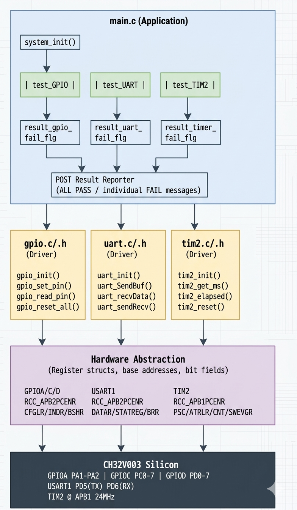

# Architecture — CH32V003 POST Framework

---

## High-Level Block Diagram

[]


---

## Layer Separation

### Layer 1 — Hardware (Silicon)

The physical CH32V003 peripherals. No code lives here — this is the target all layers above write to through memory-mapped registers.

```
Peripherals:    GPIOA, GPIOC, GPIOD
                USART1
                TIM2
                RCC (Reset and Clock Control)
                AFIO (Alternate Function I/O)
```

---

### Layer 2 — Hardware Abstraction (Register Structs)

Raw register definitions. Typedef structs mapped directly to peripheral base addresses via pointer casts. No logic — only memory layout description.

```c
// Example — GPIOD mapped at 0x40011400
typedef struct{
    uint32_t volatile gpio_cfglr;    // Configuration register for GPIO pins (MODE and CNF)
    uint32_t volatile reserved;
    uint32_t volatile gpio_indr;     // Input data register for GPIO pins
    uint32_t volatile gpio_outdr;    // Output data register for GPIO pins
    uint32_t volatile gpio_bshr;     // Bit set/reset register for GPIO pins
    uint32_t volatile gpio_bcr;      // Bit reset register for GPIO pins
    uint32_t volatile gpio_lckr;     // Additional registers can be added here if needed
}Typedef_Gpio_Port;  

#define GPIOD  ((Typedef_Gpio_Port*)0x40011400)
```

This layer is the boundary between C code and silicon. Everything above it is portable in principle — only this layer changes if porting to a different MCU.

---

### Layer 3 — Drivers (`gpio.c`, `uart.c`, `tim2.c`)

Peripheral drivers. Each driver owns exactly one peripheral and exposes a clean API. No driver calls another driver directly — they are independent.

```
gpio.c                  uart.c                  tim2.c
──────────────────      ──────────────────      ──────────────────
gpio_enable_clock()     uart_init()             tim2_init()
gpio_config_output()    uart_SendBuffer()       tim2_reset()
gpio_config_input()     uart_receiveData_       tim2_get_ms()
gpio_set_pin()           from_user_input()      tim2_elapsed()
gpio_read_pin()         uart_sendReceive()
gpio_reset_all()        uart_receiveByte()      (inline in uart.h)
                        uart_isTxEmpty()        ──────────────────
                        uart_isTxComplete()
                        uart_isRxReady()
                        uart_waitTxComplete()
                        uart_flushRx()
```

---

### Layer 4 — Application (`main.c`)

POST test orchestration. Calls driver APIs, collects pass/fail flags, and reports results over UART. No register access here — the application never touches a peripheral register directly.

```c
// Application only sees driver API — never raw registers
gpio_init(gpio_portC, 0, OUTPUT);       //  driver API
GPIOC->CFGLR |= (0x3 << 0);            //  not used in application code
```

---

## Data Flow

```
                        POST Test Execution
                        ───────────────────

  main()
    │
    ├──► gpio_reset_all()          [one-time HW reset, no return value]
    │
    ├──► tim2_init()               [starts free-running ms counter]
    │
    ├──► uart_init(PD, TX5, RX6)   [configures USART1 + GPIO AF pins]
    │
    ├──► test_GPIO()
    │         │
    │         ├── gpio_init(port, pin, OUTPUT)
    │         ├── gpio_set_pin(port, pin)
    │         ├── gpio_read_pin(port, pin) ──► INDR register
    │         │         │
    │         │         ├── 1 → PASS → uart_SendBuffer("PASS")
    │         │         └── 0 → FAIL → uart_SendBuffer("FAIL")
    │         │                         result_gpio_fail_flg = 1
    │         └── gpio_reset_pin(port, pin)
    │
    ├──► test_UART()
    │         │
    │         ├── uart_flushRx()           [drain stale loopback bytes]
    │         ├── uart_sendReceive()
    │         │         │
    │         │         ├── TX: write DATAR when TXE=1
    │         │         ├── RX: read  DATAR when RXNE=1  
    │         │         └── timeout via tim2_elapsed()
    │         │
    │         ├── strcmp(rx_buf, test_str)
    │         │         ├── match   → PASS
    │         │         └── no match → FAIL → result_uart_fail_flg = 1
    │         └── uart_SendBuffer(result)
    │
    ├──► test_TIM2()
    │         │
    │         ├── record t1 = tim2_get_ms()
    │         ├── Delay_Ms(100)
    │         ├── record t2 = tim2_get_ms()
    │         ├── elapsed = t2 - t1
    │         │         ├── 95–105ms → PASS  (±5% tolerance)
    │         │         └── outside  → FAIL → result_timer_fail_flg = 1
    │         └── uart_SendBuffer(result)
    │
    └──► POST Result Reporter
              │
              ├── result_gpio_fail_flg  == 1 → print GPIO FAIL
              ├── result_uart_fail_flg  == 1 → print UART FAIL
              ├── result_timer_fail_flg == 1 → print TIMER FAIL
              └── all flags == 0             → print ALL TESTS PASS
```

---

## Control Flow

```
                    power on / reset
                          │
                          ▼
                    gpio_reset_all()        ← must be first
                          │                   resets all port HW
                          ▼
                    tim2_init()             ← must be before uart
                          │                   uart timeout depends on it
                          ▼
                    uart_init()             ← must be after reset
                          │                   gpio_reset after this = UART dead
                          ▼
                   ┌──────────────┐
                   │  test_GPIO() │
                   └──────┬───────┘
                          │ result_gpio_fail_flg
                          ▼
                   ┌──────────────┐
                   │  test_UART() │  ← requires loopback wire PD5→PD6
                   └──────┬───────┘
                          │ result_uart_fail_flg
                          ▼
                   ┌──────────────┐
                   │  test_TIM2() │
                   └──────┬───────┘
                          │ result_timer_fail_flg
                          ▼
                   ┌──────────────────┐
                   │  Report Results  │
                   └──────┬───────────┘
                          │
               ┌──────────┴──────────┐
               │                     │
       result_flag  == 1         result_flag  == 0
               │                     │
        print each FAIL         print ALL PASS
               │                     │
               └──────────┬──────────┘
                          │
                    (application continues
                     or halts on failure)
```

---

## Why This Architecture Was Chosen

### 1. No HAL dependency

The CH32V003 vendor SDK (EVT) abstracts too much and hides register behaviour. Writing directly against registers gave full visibility into what each bit does — essential for a diagnostic tool where understanding failure modes matters more than convenience.

### 2. Layered separation keeps drivers testable in isolation

Each driver (`gpio`, `uart`, `tim2`) has no knowledge of the others. `uart.c` does not include `gpio.h`. This means each driver can be tested independently without bringing up the full system.

The one intentional exception: `uart.c` uses `tim2_get_ms()` for receive timeouts. This dependency is explicit and documented — `tim2_init()` must run before `uart_init()`.

### 3. `static inline` for register status checks

UART status checks (`uart_isRxReady`, `uart_isTxComplete`, etc.) are `static inline` in the header rather than regular functions. This gives:

- Zero function call overhead — the compiler inlines directly to a register read and bit test.
- Visibility from any `.c` file that includes `uart.h` — no linker symbol needed.
- Readability — `while(!uart_isTxComplete())` is self-documenting at the call site.

### 4. Proper Timer initialization rather then countdown loop (--timeout).

TIM2 runs independently of the CPU. `tim2_elapsed()` always measures real wall-clock milliseconds regardless of what the compiler does to surrounding code.

### 5. Interleaved TX/RX for loopback

The USART1 `DATAR` register is shared between TX and RX. Finishing all TX then starting RX means every received byte except the last has already been overwritten (1-byte hardware buffer). The `uart_sendReceive()` function writes the next TX byte when `TXE=1` and reads the next RX byte when `RXNE=1` inside the same loop — this is the only correct way to do loopback.

### 6. Fail flags over early exit

Each test sets an independent flag (`result_gpio_fail_flg`, `result_uart_fail_flg`, `result_timer_fail_flg`) rather than aborting on first failure. This means all three peripherals are always tested and all failures are reported in a single POST run — useful during board bring-up where multiple faults may exist simultaneously.

---

## Dependency Map

```
main.c
  ├── gpio.h     (gpio_init, gpio_set_pin, gpio_read_pin, gpio_reset_all)
  ├── uart.h     (uart_init, uart_SendBuffer, uart_sendReceive, inline status)
  └── tim2.h     (tim2_init, tim2_get_ms, tim2_elapsed)

uart.c
  └── tim2.h     (tim2_get_ms, tim2_elapsed — for receive timeout)

gpio.c
  └── (no driver dependencies)

tim2.c
  └── (no driver dependencies)
```
